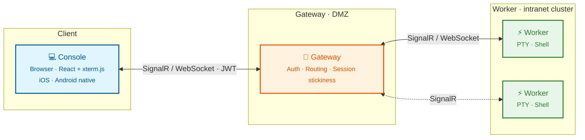

# Corterm

**Remote Terminals, Everywhere.**

[简体中文](README.zh-CN.md)

[](https://github.com/monster-echo/CortexTerminal2/actions/workflows/ci.yml)
[](https://github.com/monster-echo/CortexTerminal2/pkgs/container/corterm-gateway)
[](https://github.com/monster-echo/CortexTerminal2/releases)

Corterm is a remote terminal platform. Install a lightweight Worker on any machine, deploy the Gateway, and access your terminals from any browser or mobile device -- your shell keeps running even after you close the tab.

## Architecture



- **Gateway** -- Central server handling authentication, session routing, and real-time communication.
- **Worker** -- Lightweight agent that runs on your machines, manages PTY sessions, and streams I/O back to the Gateway.
- **Console** -- Browser-based terminal UI served by the Gateway. Also available as native iOS and Android apps.

## Features

- **Browser-Native Terminal** -- Full xterm.js terminal with WebGL rendering. Works on desktop, tablet, and mobile.
- **Session Persistence** -- Detach and reattach at any time. Your shell keeps running. Previous output is replayed on reattach.
- **Multi-Worker** -- Connect and manage any number of remote machines from a single Gateway.
- **Mobile Access** -- Native iOS and Android apps with custom terminal keyboard, haptic feedback, and responsive layout.
- **AI Agent Tracking** -- Watch Claude Code work in real time. `cortap` captures every prompt, tool call, and notification; the Console renders them as a structured timeline so you can monitor agents running on any worker.
- **File Transfer** -- Bidirectional file exchange between Console and Worker via S3-compatible storage. Drop a file in the Console and it lands in the shell's working directory; files written to `$CORTERM_ARTIFACTS_DIR` show up as downloadable bubbles.
- **Resource Monitoring** -- Live CPU and memory metrics for every worker, plus latency probes between client and worker.
- **Multiple Auth Methods** -- Password, phone SMS, GitHub OAuth, Google OAuth, and Apple Sign-In.
- **Worker Management** -- Monitor status, trigger remote upgrades, and run diagnostics (`corterm doctor`).
- **Admin Dashboard** -- User management, invitations, role-based access, and audit logging.

## Quick Start

### 1. Deploy the Gateway

```bash
docker run -p 5045:5045 ghcr.io/monster-echo/corterm-gateway:latest
```

### 2. Install the Worker

**Linux / macOS:**

```bash
curl -fsSL https://corterm.rwecho.top/install.sh | sh
```

**Windows (PowerShell):**

```powershell
powershell -Command "irm https://corterm.rwecho.top/install.ps1 | iex"
```

### 3. Open Your Browser

Navigate to `http://localhost:5045`, log in, and start a terminal session.

## Platform Support

**Worker:** Linux (amd64 / arm64) · macOS (Apple Silicon) · Windows x64 · Docker

**Client:** Any modern browser · iOS · Android

### Mobile App Download

<table>
  <tr>
    <td align="center">
      <a href="https://apps.apple.com/us/app/corterm/id6767838640">
        
      </a>
      <br/>App Store
    </td>
    <td align="center">
      <a href="https://play.google.com/store/apps/details?id=top.rwecho.cortexterminal">
        
      </a>
      <br/>Google Play
    </td>
    <td align="center">
      <a href="https://appgallery.huawei.com/app/detail?id=top.rwecho.cortexterminal">
        
      </a>
      <br/>AppGallery
    </td>
    <td align="center">
      <a href="https://minio.myhome.rwecho.top:8443/minio/n8n-data/corterm/android/">
        
      </a>
      <br/>Android APK
    </td>
  </tr>
</table>

## Tech Stack

.NET 10 (Gateway / Worker) · React 19 + xterm.js (Console) · .NET MAUI + Ionic (Mobile) · SignalR + MessagePack

## Running Tests

Unit tests run on every push via CI. Run them locally:

```bash
dotnet test tests/Gateway/CortexTerminal.Gateway.Tests --configuration Release --filter "Category!=Integration"
dotnet test tests/Worker/CortexTerminal.Worker.Tests --configuration Release --filter "Category!=Integration"
```

S3-compatible storage integration tests are opt-in (tagged `Category=Integration`). Boot MinIO locally and then run the filter:

```bash
bash scripts/start-test-minio.sh
dotnet test tests/Gateway --filter "Category=Integration"
```

The script uses Podman by default (Docker works too) and provisions a `corterm-artifacts-test` bucket separate from production. Override credentials via `CORTERM_TEST_S3_*` environment variables if needed.

## Roadmap

- [x] **File Transfer** -- Bidirectional file exchange between Console and Worker via S3 presigned URLs (see below)
- [x] **`cortap` CLI** -- Wrap `claude` (and other agents) to capture every hook event locally and forward to the Worker (see below)
- [ ] **Port Forwarding** -- Tunnel local ports to remote machines via the Gateway
- [ ] **Structured Output** -- Render common command outputs (`top`, `ps`, `docker ps`) as interactive cards instead of raw text
- [ ] **Multi-tab Terminal** -- Open multiple sessions in a single browser tab
- [ ] **Command Snippets** -- Save and reuse frequently used commands across sessions

## cortap

`cortap` is an optional CLI that wraps agent binaries (`claude`, etc.) and captures every Claude Code hook event two ways:

1. **Worker mode** (default when run inside a Corterm PTY): events POST to the Worker HTTP endpoint, which forwards them over SignalR to the Console / Mobile UI.
2. **Independent mode** (when no Worker is reachable): events are written to a local JSONL log at `~/.corterm/sessions/<sessionId>/events.jsonl`.

Both paths always run -- even in Worker mode the local JSONL is written, so you have an audit trail and can replay events even if the Worker is down.

### Usage

```bash
# Wrap claude -- works with or without a Worker running. Stays silent so the agent's
# native TUI experience is preserved; find your session later via `cortap sessions`.
cortap claude
```

### Subcommands

```bash
# Live-follow the most recent active session (or list if multiple)
cortap tail

# Follow a specific session
cortap tail <sessionId>

# Merge all active sessions with a session-id prefix per line
cortap tail --all

# One-shot dump (no follow)
cortap tail --no-follow

# List every session Worker-mode and independent-mode has logged
cortap sessions

# Query past events with filters
cortap events --session <id> --since 1h --grep "Bash"
cortap events --session <id> --event PostToolUse
cortap events --last 50
```

### Session log layout

```
~/.corterm/sessions/
├── <sessionId>/
│   ├── meta.json         # sessionId, kind, cwd, startedAt, endedAt?, pid
│   ├── events.jsonl      # one JSON envelope per hook event
│   └── pid               # cortap main process PID (deleted on clean exit)
└── ...
```

Crashed sessions (where the PID file points to a dead process with no `endedAt`) are detected on next `cortap` invocation and marked `crashed: true` in `meta.json`.

## Session Artifacts (File Transfer)

Corterm ships with a WeChat-File-Helper-style file feed for every terminal session. Files flow Console ↔ Worker through S3-compatible storage (AWS S3, MinIO, Cloudflare R2). The Gateway brokers presigned URLs and never relays file bytes -- bandwidth stays cheap on the hosted plan.

**Asymmetric sync:**

- Console uploads land in `$CORTERM_ARTIFACTS_DIR` on the Worker instantly so the shell (and AI agents like Claude Code) can read them.
- Worker outputs (`echo foo > $CORTERM_ARTIFACTS_DIR/log.txt`) appear as Worker-side bubbles in real time via SignalR. Nothing auto-downloads to your phone -- tap a bubble to fetch on demand.

**Data flow:** the Gateway only brokers presigned URLs; file bytes always travel directly between Console/Worker and S3.

```mermaid
sequenceDiagram
    autonumber
    participant C as Console
    participant G as Gateway
    participant S3 as S3 / R2 / MinIO
    participant W as Worker

    rect rgb(227, 245, 254)
    note over C,W: Console → Worker (drop a file into the shell's cwd)
    C->>G: request presigned PUT URL
    G->>C: presigned PUT URL
    C->>S3: PUT file bytes
    C->>G: CompleteArtifactUpload
    G->>W: SignalR NotifyArtifactUploaded (with GET URL)
    W->>S3: GET, verify sha256
    W->>W: write into $CORTERM_ARTIFACTS_DIR
    end

    rect rgb(232, 245, 233)
    note over C,W: Worker → Console (shell produces a file)
    W->>W: detects new file in $CORTERM_ARTIFACTS_DIR
    W->>G: request presigned PUT URL
    G->>W: presigned PUT URL
    W->>S3: PUT file bytes
    W->>G: CompleteArtifactUpload
    G->>C: SignalR artifact bubble
    Note over C: no auto-download; fetch on tap
    C->>G: request presigned GET URL
    G->>C: presigned GET URL
    C->>S3: GET file bytes
    end
```

**Expiration:** every artifact has a 7-day TTL. Terminating a session tightens its artifacts to a 24h grace window. A background sweep cleans S3 + DB.

**Claude Code auto-context:** when the user submits their next prompt, the Corterm hook lists uploaded files in Claude Code's context automatically -- no need to manually `@$CORTERM_ARTIFACTS_DIR/foo.png`. The agent sees the file list and decides whether to read it. (Codex support is on the roadmap.)

### Configuration

Gateway `appsettings.json`:

```json
"Storage": {
  "Endpoint": "https://s3.amazonaws.com",
  "Bucket": "corterm-artifacts",
  "Region": "us-east-1",
  "AccessKey": "...",
  "SecretKey": "...",
  "ForcePathStyle": false,
  "PresignedUrlTtl": "00:05:00",
  "MaxArtifactSizeBytes": 52428800,
  "MaxArtifactAgeDays": 7,
  "GracePeriodHours": 24
}
```

For local MinIO:

```bash
docker compose -f deploy/docker-compose.minio.yml up -d
```

Then point `Storage:Endpoint` at `http://localhost:9000` and set `ForcePathStyle: true`.

### Worker contract

PTY processes inherit `CORTERM_ARTIFACTS_DIR=~/.corterm/sessions/{sessionId}/artifacts/`. The Worker auto-uploads files written there and auto-downloads files uploaded from the Console. **The Worker never holds S3 credentials** -- it asks the Gateway for presigned URLs, same as the Console.

## License

[MIT](LICENSE)
