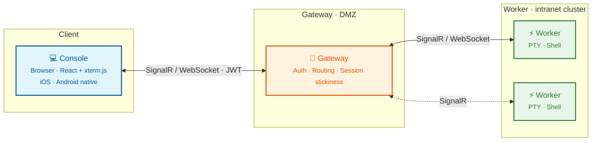
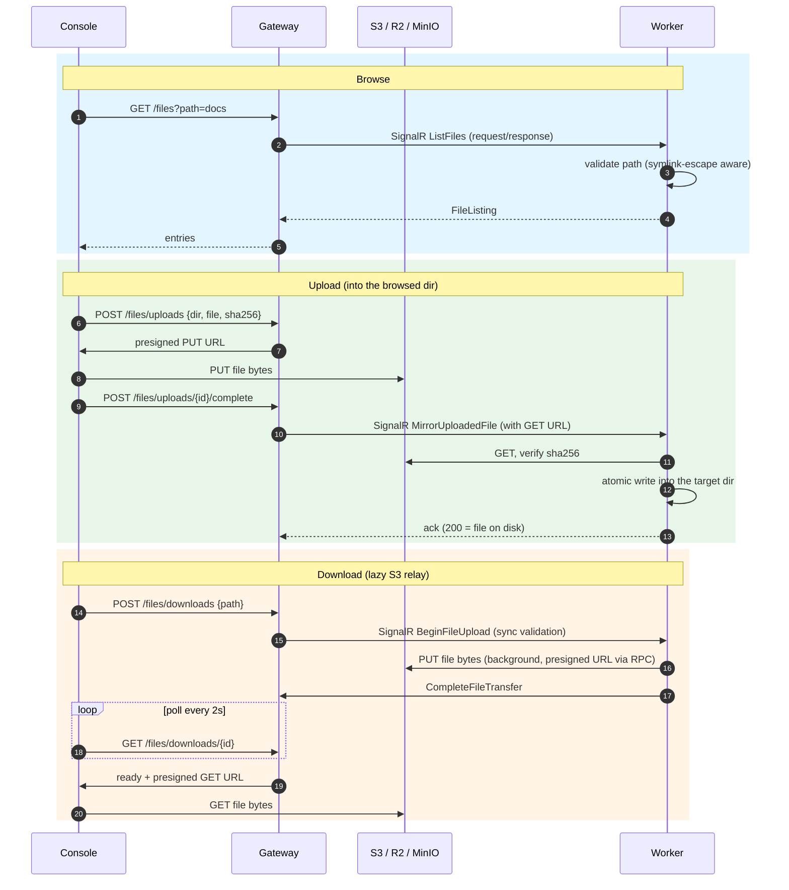

# Corterm

**Remote Terminals, Everywhere.**

[简体中文](README.zh-CN.md)

[](https://github.com/monster-echo/CortexTerminal2/actions/workflows/ci.yml)
[](https://github.com/monster-echo/CortexTerminal2/pkgs/container/corterm-gateway)
[](https://github.com/monster-echo/CortexTerminal2/releases)

Corterm is a remote terminal platform. Install a lightweight Worker on any machine, deploy the Gateway, and access your terminals from any browser or mobile device -- your shell keeps running even after you close the tab.

## Architecture


```mermaid
graph LR
    classDef client fill:#e1f5fe,stroke:#01579b,stroke-width:2px,color:#01579b;
    classDef gateway fill:#fff3e0,stroke:#e65100,stroke-width:2px,color:#e65100;
    classDef worker fill:#e8f5e9,stroke:#2e7d32,stroke-width:2px,color:#2e7d32;

    subgraph Client ["Client"]
        Console["💻 Console<br><small>Browser · React + xterm.js<br>iOS · Android native</small>"]:::client
    end

    subgraph DMZ ["Gateway · DMZ"]
        Gateway["🚪 Gateway<br><small>Auth · Routing · Session stickiness</small>"]:::gateway
    end

    subgraph Cluster ["Worker · intranet cluster"]
        Worker1["⚡ Worker<br><small>PTY · Shell</small>"]:::worker
        Worker2["⚡ Worker<br><small>PTY · Shell</small>"]:::worker
    end

    Console <-->|"SignalR / WebSocket · JWT"| Gateway
    Gateway <-->|"SignalR / WebSocket"| Worker1
    Gateway <-.->|"SignalR"| Worker2
```

- **Gateway** -- Central server handling authentication, session routing, and real-time communication.
- **Worker** -- Lightweight agent that runs on your machines, manages PTY sessions, and streams I/O back to the Gateway.
- **Console** -- Browser-based terminal UI served by the Gateway. Also available as native iOS and Android apps.

## Features

- **Browser-Native Terminal** -- Full xterm.js terminal with WebGL rendering. Works on desktop, tablet, and mobile.
- **Session Persistence** -- Detach and reattach at any time. Your shell keeps running. Previous output is replayed on reattach.
- **Multi-Worker** -- Connect and manage any number of remote machines from a single Gateway.
- **Mobile Access** -- Native iOS and Android apps with custom terminal keyboard, haptic feedback, and responsive layout.
- **AI Agent Tracking** -- Watch Claude Code work in real time. `cortap` captures every prompt, tool call, and notification; the Console renders them as a structured timeline so you can monitor agents running on any worker.
- **File Transfer** -- Bidirectional file exchange between Console and Worker via S3-compatible storage. Drop a file in the Console and it lands in the shell's working directory; files written to `$CORTERM_ARTIFACTS_DIR` show up as downloadable bubbles.
- **Resource Monitoring** -- Live CPU and memory metrics for every worker, plus latency probes between client and worker.
- **Multiple Auth Methods** -- Password, phone SMS, GitHub OAuth, Google OAuth, and Apple Sign-In.
- **Worker Management** -- Monitor status, trigger remote upgrades, and run diagnostics (`corterm doctor`).
- **Admin Dashboard** -- User management, invitations, role-based access, and audit logging.

## Quick Start

### 1. Deploy the Gateway

```bash
docker run -p 5045:5045 ghcr.io/monster-echo/corterm-gateway:latest
```

### 2. Install the Worker

**Linux / macOS:**

```bash
curl -fsSL https://corterm.rwecho.top/install.sh | sh
```

**Windows (PowerShell):**

```powershell
powershell -Command "irm https://corterm.rwecho.top/install.ps1 | iex"
```

### 3. Open Your Browser

Navigate to `http://localhost:5045`, log in, and start a terminal session.

## Platform Support

**Worker:** Linux (amd64 / arm64) · macOS (Apple Silicon) · Windows x64 · Docker

**Client:** Any modern browser · iOS · Android

### Mobile App Download

<table>
  <tr>
    <td align="center">
      <a href="https://apps.apple.com/us/app/corterm/id6767838640">
        
      </a>
      <br/>App Store
    </td>
    <td align="center">
      <a href="https://play.google.com/store/apps/details?id=top.rwecho.cortexterminal">
        
      </a>
      <br/>Google Play
    </td>
    <td align="center">
      <a href="https://appgallery.huawei.com/app/detail?id=top.rwecho.cortexterminal">
        
      </a>
      <br/>AppGallery
    </td>
    <td align="center">
      <a href="https://minio.myhome.rwecho.top:8443/minio/n8n-data/corterm/android/">
        
      </a>
      <br/>Android APK
    </td>
  </tr>
</table>

## Tech Stack

.NET 10 (Gateway / Worker) · React 19 + xterm.js (Console) · .NET MAUI + Ionic (Mobile) · SignalR + MessagePack

## Running Tests

Unit tests run on every push via CI. Run them locally:

```bash
dotnet test tests/Gateway/CortexTerminal.Gateway.Tests --configuration Release --filter "Category!=Integration"
dotnet test tests/Worker/CortexTerminal.Worker.Tests --configuration Release --filter "Category!=Integration"
```

S3-compatible storage integration tests are opt-in (tagged `Category=Integration`). Boot MinIO locally and then run the filter:

```bash
bash scripts/start-test-minio.sh
dotnet test tests/Gateway --filter "Category=Integration"
```

The script uses Podman by default (Docker works too) and provisions a `corterm-artifacts-test` bucket separate from production. Override credentials via `CORTERM_TEST_S3_*` environment variables if needed.

## Roadmap

- [x] **File Transfer** -- Bidirectional file exchange between Console and Worker via S3 presigned URLs (see below)
- [x] **`cortap` CLI** -- Wrap `claude` (and other agents) to capture every hook event locally and forward to the Worker (see below)
- [ ] **Port Forwarding** -- Tunnel local ports to remote machines via the Gateway
- [ ] **Structured Output** -- Render common command outputs (`top`, `ps`, `docker ps`) as interactive cards instead of raw text
- [ ] **Multi-tab Terminal** -- Open multiple sessions in a single browser tab
- [ ] **Command Snippets** -- Save and reuse frequently used commands across sessions

## cortap

`cortap` is an optional CLI that wraps agent binaries (`claude`, etc.) and captures every Claude Code hook event two ways:

1. **Worker mode** (default when run inside a Corterm PTY): events POST to the Worker HTTP endpoint, which forwards them over SignalR to the Console / Mobile UI.
2. **Independent mode** (when no Worker is reachable): events are written to a local JSONL log at `~/.corterm/sessions/<sessionId>/events.jsonl`.

Both paths always run -- even in Worker mode the local JSONL is written, so you have an audit trail and can replay events even if the Worker is down.

### Usage

```bash
# Wrap claude -- works with or without a Worker running. Stays silent so the agent's
# native TUI experience is preserved; find your session later via `cortap sessions`.
cortap claude
```

### Subcommands

```bash
# Live-follow the most recent active session (or list if multiple)
cortap tail

# Follow a specific session
cortap tail <sessionId>

# Merge all active sessions with a session-id prefix per line
cortap tail --all

# One-shot dump (no follow)
cortap tail --no-follow

# List every session Worker-mode and independent-mode has logged
cortap sessions

# Query past events with filters
cortap events --session <id> --since 1h --grep "Bash"
cortap events --session <id> --event PostToolUse
cortap events --last 50
```

### Session log layout

```
~/.corterm/sessions/
├── <sessionId>/
│   ├── meta.json         # sessionId, kind, cwd, startedAt, endedAt?, pid
│   ├── events.jsonl      # one JSON envelope per hook event
│   └── pid               # cortap main process PID (deleted on clean exit)
└── ...
```

Crashed sessions (where the PID file points to a dead process with no `endedAt`) are detected on next `cortap` invocation and marked `crashed: true` in `meta.json`.

## Remote Files (Folder Manager)

The phone's files page is a read-only folder manager over the Worker's session root -- the PTY working directory (the user's home). No prompt, skill, or environment variable is injected into your shell or AI agents: files live where your shell works, and the agent needs to know nothing.

**Capabilities:**

- Browse the live directory tree of the session root (dotfiles included, symlinks that stay inside the root are followed).
- Download any file on demand: the Worker pushes it to S3 only when you tap it, then your phone fetches it.
- Upload files into the currently browsed directory: sha256 verified end to end, existing files are overwritten.

There is no mkdir/rename/delete from the phone -- manage files in the terminal, the way you already do.

**Data flow:** the Gateway only brokers presigned URLs and transfers state; file bytes always travel directly between Console/Worker and S3. Transfers are capped (default 50 MB per file) and the transit objects are reaped automatically.


```mermaid
sequenceDiagram
    autonumber
    participant C as Console
    participant G as Gateway
    participant S3 as S3 / R2 / MinIO
    participant W as Worker

    rect rgb(227, 245, 254)
    note over C,W: Browse
    C->>G: GET /files?path=docs
    G->>W: SignalR ListFiles (request/response)
    W->>W: validate path (symlink-escape aware)
    W-->>G: FileListing
    G-->>C: entries
    end

    rect rgb(232, 245, 233)
    note over C,W: Upload (into the browsed dir)
    C->>G: POST /files/uploads {dir, file, sha256}
    G->>C: presigned PUT URL
    C->>S3: PUT file bytes
    C->>G: POST /files/uploads/{id}/complete
    G->>W: SignalR MirrorUploadedFile (with GET URL)
    W->>S3: GET, verify sha256
    W->>W: atomic write into the target dir
    W-->>G: ack (200 = file on disk)
    end

    rect rgb(255, 244, 230)
    note over C,W: Download (lazy S3 relay)
    C->>G: POST /files/downloads {path}
    G->>W: SignalR BeginFileUpload (sync validation)
    W->>S3: PUT file bytes (background, presigned URL via RPC)
    W->>G: CompleteFileTransfer
    loop poll every 2s
        C->>G: GET /files/downloads/{id}
    end
    G->>C: ready + presigned GET URL
    C->>S3: GET file bytes
    end
```

**Security model:** every path from the phone is validated on the Worker -- it must resolve inside the session root, with every symlink followed to its final target (a link pointing outside the root is rejected). Transfer requests are authorized per session and per user; the in-memory transfer registry means a Gateway restart surfaces as a retryable 404 rather than stale state.

### Configuration

Gateway `appsettings.json`:

```json
"Storage": {
  "Endpoint": "https://s3.amazonaws.com",
  "Bucket": "corterm-artifacts",
  "Region": "us-east-1",
  "AccessKey": "...",
  "SecretKey": "...",
  "ForcePathStyle": false,
  "PresignedUrlTtl": "00:05:00"
},
"RemoteFiles": {
  "MaxTransferSizeBytes": 52428800,
  "PendingTransferTtl": "00:15:00",
  "ObjectRetention": "01:00:00",
  "CleanupInterval": "00:10:00"
}
```

For local MinIO:

```bash
docker compose -f deploy/docker-compose.minio.yml up -d
```

Then point `Storage:Endpoint` at `http://localhost:9000` and set `ForcePathStyle: true`.

### Worker contract

The Worker owns path safety and file operations: it lists directories, mirrors uploads (`.downloading` temp file, sha256 check, atomic rename), and pushes downloads via Gateway-issued presigned URLs. **The Worker never holds S3 credentials** -- same as the Console.

## License

[MIT](LICENSE)
