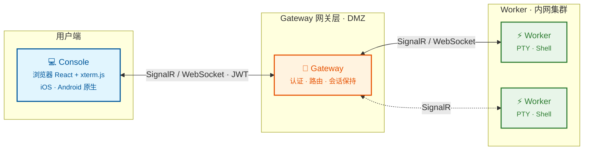
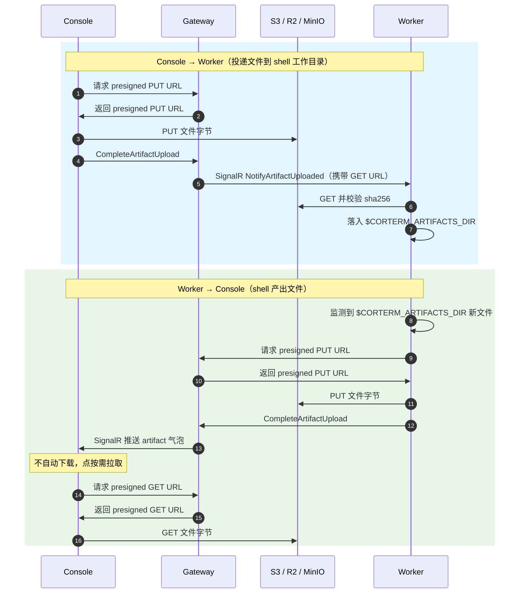

# Corterm

**远程终端，触手可及。**

[English](README.md)

[](https://github.com/monster-echo/CortexTerminal2/actions/workflows/ci.yml)
[](https://github.com/monster-echo/CortexTerminal2/pkgs/container/corterm-gateway)
[](https://github.com/monster-echo/CortexTerminal2/releases)

Corterm 是一个远程终端平台。在任意机器上安装轻量级 Worker，部署 Gateway，即可通过浏览器或手机访问终端——关掉页面，Shell 依然在后台运行。

## 架构



- **Gateway** -- 中心服务器，负责认证、会话路由和实时通信。
- **Worker** -- 轻量级代理，运行在被管理机器上，负责 PTY 会话管理和 I/O 流转发。
- **Console** -- 浏览器终端界面，同时提供 iOS 和 Android 原生客户端。

## 功能

- **浏览器原生终端** -- 基于 xterm.js + WebGL 渲染的完整终端，桌面、平板、手机通用。
- **会话持久化** -- 随时断开和重连，Shell 持续运行，重连时自动回放历史输出。
- **多机管理** -- 单个 Gateway 连接和管理任意数量的远程机器。
- **移动端支持** -- iOS / Android 原生应用，内置终端虚拟键盘、触觉反馈和自适应布局。
- **AI Agent 追踪** -- 实时查看 Claude Code 的工作过程。`cortap` 捕获每次 prompt、工具调用和通知，Console 渲染为结构化时间线，让你能监控任意 Worker 上跑着的 agent。
- **文件传输** -- Console 与 Worker 之间的双向文件交换，基于 S3 兼容存储。Console 投递的文件会立即落到 shell 工作目录；写入 `$CORTERM_ARTIFACTS_DIR` 的文件会以气泡形式出现，按需下载。
- **资源监控** -- 每个 Worker 的实时 CPU / 内存占用，加上客户端到 Worker 的延迟探测。
- **多种登录方式** -- 密码、手机短信、GitHub OAuth、Google OAuth、Apple Sign-In。
- **Worker 管理** -- 监控状态、远程升级、诊断检查（`corterm doctor`）。
- **管理后台** -- 用户管理、邀请、角色权限、审计日志。

## 快速开始

### 1. 部署 Gateway

```bash
docker run -p 5045:5045 ghcr.io/monster-echo/corterm-gateway:latest
```

### 2. 安装 Worker

**Linux / macOS：**

```bash
curl -fsSL https://corterm.rwecho.top/install.sh | sh
```

**Windows (PowerShell)：**

```powershell
powershell -Command "irm https://corterm.rwecho.top/install.ps1 | iex"
```

### 3. 打开浏览器

访问 `http://localhost:5045`，登录后即可开启终端会话。

## 平台支持

**Worker：** Linux (amd64 / arm64) · macOS (Apple Silicon) · Windows x64 · Docker

**客户端：** 任意现代浏览器 · iOS · Android

### 移动端下载

<table>
  <tr>
    <td align="center">
      <a href="https://apps.apple.com/us/app/corterm/id6767838640">
        
      </a>
      <br/>App Store
    </td>
    <td align="center">
      <a href="https://play.google.com/store/apps/details?id=top.rwecho.cortexterminal">
        
      </a>
      <br/>Google Play
    </td>
    <td align="center">
      <a href="https://appgallery.huawei.com/app/detail?id=top.rwecho.cortexterminal">
        
      </a>
      <br/>华为应用市场
    </td>
    <td align="center">
      <a href="https://minio.myhome.rwecho.top:8443/minio/n8n-data/corterm/android/">
        
      </a>
      <br/>安卓 APK 下载
    </td>
  </tr>
</table>

## 技术栈

.NET 10 (Gateway / Worker) · React 19 + xterm.js (Console) · .NET MAUI + Ionic (Mobile) · SignalR + MessagePack

## 运行测试

CI 在每次 push 时运行单元测试。本地运行：

```bash
dotnet test tests/Gateway/CortexTerminal.Gateway.Tests --configuration Release --filter "Category!=Integration"
dotnet test tests/Worker/CortexTerminal.Worker.Tests --configuration Release --filter "Category!=Integration"
```

S3 兼容存储集成测试为可选（标记为 `Category=Integration`）。本地启动 MinIO 后再运行筛选：

```bash
bash scripts/start-test-minio.sh
dotnet test tests/Gateway --filter "Category=Integration"
```

脚本默认使用 Podman（也支持 Docker），会创建独立于生产环境的 `corterm-artifacts-test` 桶。如需自定义凭据，通过 `CORTERM_TEST_S3_*` 环境变量覆盖。

## Roadmap

- [x] **文件传输** -- Console 与 Worker 之间通过 S3 presigned URL 双向传输（详见下文）
- [x] **`cortap` CLI** -- 包装 `claude` 等代理，将每个 hook 事件落本地日志并转发到 Worker（详见下文）
- [ ] **端口转发** -- 通过 Gateway 将本地端口隧道转发到远程机器
- [ ] **结构化输出** -- 将常见命令输出（`top`、`ps`、`docker ps`）渲染为可交互的卡片
- [ ] **多标签终端** -- 在单个浏览器标签页中打开多个会话
- [ ] **命令片段** -- 保存并复用常用命令

## cortap

`cortap` 是可选的 CLI 工具，用于包装代理二进制（`claude` 等），并通过两条路径捕获 Claude Code 的每个 hook 事件：

1. **Worker 模式**（在 Corterm PTY 中启动时默认开启）：事件通过 HTTP POST 上报到 Worker，再经 SignalR 转发给 Console / 移动端 UI。
2. **独立模式**（无 Worker 可达时）：事件以 JSONL 格式写入 `~/.corterm/sessions/<sessionId>/events.jsonl`。

两条路径会同时启用 —— 即使在 Worker 模式下，本地 JSONL 也会同步写入，作为审计日志和 Worker 离线时的回放数据源。

### 用法

```bash
# 包装 claude —— Worker 在不在都能跑。全程静默,不影响 agent 原生 TUI;
# 之后用 `cortap sessions` 查历史 session。
cortap claude
```

### 子命令

```bash
# 实时跟随最近一个活跃 session（多个时列出全部让你选）
cortap tail

# 跟随指定 session
cortap tail <sessionId>

# 合并所有活跃 session，每行带 session 前缀
cortap tail --all

# 一次性输出（不跟随）
cortap tail --no-follow

# 列出所有已记录的 session
cortap sessions

# 带过滤条件查询历史事件
cortap events --session <id> --since 1h --grep "Bash"
cortap events --session <id> --event PostToolUse
cortap events --last 50
```

### Session 日志布局

```
~/.corterm/sessions/
├── <sessionId>/
│   ├── meta.json         # sessionId、kind、cwd、startedAt、endedAt?、pid
│   ├── events.jsonl      # 每个 hook 事件一行 JSON
│   └── pid               # cortap 主进程 PID（正常退出时删除）
└── ...
```

崩溃的 session（pid 文件指向已死进程且 meta.json 无 `endedAt`）会在下一次 `cortap` 启动时被检测到，并在 meta.json 中标记 `crashed: true`。

## 会话文件（Session Artifacts）

每个终端会话都内置了 WeChat 文件助手风格的文件流。文件在 Console 与 Worker 之间通过 S3 兼容存储（AWS S3、MinIO、Cloudflare R2）流转。Gateway 只签发 presigned URL，从不中转文件字节 —— 托管服务的带宽完全不被文件流量影响。

**非对称自动同步：**

- Console 上传的文件会立即落到 Worker 的 `$CORTERM_ARTIFACTS_DIR` 目录里，shell（包括 Claude Code 之类的 AI agent）可以马上读到。
- Worker 输出（`echo foo > $CORTERM_ARTIFACTS_DIR/log.txt`）通过 SignalR 实时出现在你手机上的"Worker 同步"气泡里。**不会**自动下载到手机 —— 你点击气泡时才按需拉取。

**数据流时序：** Gateway 全程只签发 presigned URL，文件字节始终在 Console/Worker 与 S3 之间直传。



**过期模型：** 每个 artifact 默认有 7 天 TTL。Session terminate 时该 session 的所有 artifact 过期时间会收紧到 24 小时宽限期。后台服务定期清理 S3 + DB。

**Claude Code 自动注入上下文：** 用户下一次提交 prompt 时,Corterm hook 会把已上传的文件列表自动注入 Claude Code 的 context —— 不需要手动 `@$CORTERM_ARTIFACTS_DIR/foo.png`。Claude 看到文件列表后自己决定是否读取。(Codex 支持在 roadmap 里。)

### 配置

Gateway `appsettings.json`：

```json
"Storage": {
  "Endpoint": "https://s3.amazonaws.com",
  "Bucket": "corterm-artifacts",
  "Region": "us-east-1",
  "AccessKey": "...",
  "SecretKey": "...",
  "ForcePathStyle": false,
  "PresignedUrlTtl": "00:05:00",
  "MaxArtifactSizeBytes": 52428800,
  "MaxArtifactAgeDays": 7,
  "GracePeriodHours": 24
}
```

本地 MinIO：

```bash
docker compose -f deploy/docker-compose.minio.yml up -d
```

然后把 `Storage:Endpoint` 指向 `http://localhost:9000`，并把 `ForcePathStyle` 设为 `true`。

### Worker 契约

PTY 进程会继承 `CORTERM_ARTIFACTS_DIR=~/.corterm/sessions/{sessionId}/artifacts/` 环境变量。Worker 自动上传写入此目录的文件，并自动下载 Console 上传的文件。**Worker 全程不持有 S3 凭证** —— 它向 Gateway 申请 presigned URL，跟 Console 完全对称。

## 许可证

[MIT](LICENSE)
